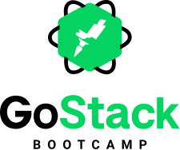

<h1 align="center">
    
  
</h1>

<strong>O projeto FastFeet é uma solução simples ponta-a-ponta para gestão de encomendas.</strong>

Abrangendo três camadas -- server API (backend), interface web para gestão (frontend) e aplicativo móvel para entregadores (mobile) --, a aplicação é desafio final para avaliação e emissão de certificado do treinamento online <em>GoStack</em> criado e lecionado pela <a href="https://rocketseat.com.br/">Rocketseat</a>.

<h5><em>Foco do bootcamp, a stack utilizada no desenvolvimento é baseada na linguagem JavaScript, composta por Node.js, ReactJS e React Native.</em></h5>

---

## Notas

> A aplicação móvel (`mobile`) foi desenvolvida e testada apenas em ambientes **Android** -- via USB em dispositivo físico e em emulador _Genymotion_ da [Genymobile](https://www.genymobile.com/). Nenhum teste foi feito para o iOS, logo, rodar em tal ambiente pode demandar alguma adaptação no código.

> Se for do interesse utilizar a solução em ambiente de produção, uma revisão e algumas alterações na segurança do projeto precisarão ser feitas.

## Instalação

Para as três camadas desenvolvidas da aplicação, `backend` [[1]] [[2]], `frontend` [[3]] e `mobile` [[4]], a "instalação" é feita com a execução do comando `yarn` (ou `npm install`) dentro de suas respectivas pastas.

Previamente, tenha instalado em seu ambiente o [Node.js](https://nodejs.org/) e, caso utilizado, o [Yarn](https://yarnpkg.com/). _Durante o desenvolvimento deste projeto, foram utilizadas as versões 10.16.3 do Node.js (com a versão 6.9.0 do npm) e 1.21.1 do Yarn._

Este projeto conta com os bancos de dados [PostgreSQL](https://www.postgresql.org/) e [Redis](https://redis.io/) no backend. _Respectivamente, as versões 11.6 e 5.0.5 foram as utilizadas durante o desenvolvimento, através de imagens oficiais para o [Docker](https://www.docker.com/)._

_Para rodar o aplicativo móvel, algumas configurações precisarão ser feitas para que aplicações Android desenvolvidas em React Native possam ser executadas através do computador. Um guia completo de configuração e resolução de problemas foi feito pela equipe da Rocketseat e pode ser acessado [aqui](https://react-native.rocketseat.dev/)._

## Configurações necessárias

### Backend

O backend utiliza a biblioteca [dotenv](https://github.com/motdotla/dotenv) para gerenciar algumas variáveis do ambiente da aplicação. Um arquivo `.env` deve ser disponibilizado na pasta raiz desta camada, seguindo como exemplo o arquivo `.env.example` disponível na pasta, preenchendo-se as variáveis sem valores atribuídos.

A aplicação faz o envio de e-mails em algumas ocasiões -- o banco de dados Redis é utilizado exclusivamente na gestão das filas de e-mails a enviar. Entre as variávies de ambiente, as iniciadas com `MAIL_` servem para a configuração do servidor SMTP responsável pelo envio. Nelas podem ser configurados serviços de teste de envio de e-mails como o [Mailtrap](https://mailtrap.io/), por exemplo.

### Frontend

A solução dotenv também é utilizada no frontend em ReactJS. No arquivo `.env`, que também precisará ser disponibilizado na pasta raiz desta camada, a variável `REACT_APP_API_URL` precisa estar configurada com o endereço e a porta onde a API da aplicação (camada backend) estará rodando. Já há um arquivo `.env.example` de exemplo disponível.

Se for do interesse, para debugging do _Store_ do Redux e das chamadas à API é utilizado o [Reactotron](https://github.com/infinitered/reactotron).

### Mobile (Android)

Para o aplicativo móvel, o endereço e a porta onde a API estará rodando são configurados diretamente no arquivo que exporta o serviço de chamadas à API (`mobile/src/services/api.js`).

O app também está configurado para utilizar o Reactotron na inspeção do Redux e das chamadas à API. A porta padrão utilizada pelo Reactotron é a `9090` e provavelmente o redirecionamento dessa porta precisará ser feito com o comando `adb reverse tcp:9090 tcp:9090`. Dependendo de como a aplicação será executada, em dispositivo físico ou emulador, a chamada do método `configure()` no arquivo de configuração do Reactotron (`mobile/src/config/ReactotronConfig.js`) pode precisar ser editada especificando o IP do computador na rede ([um exemplo](https://github.com/infinitered/reactotron/issues/162#issuecomment-514042089)).

## Execução dos ambientes

### Backend

_Os bancos PostgreSQL e Redis devem ser previamente iniciados._

| Comando      | Função                                    |
| ------------ | ----------------------------------------- |
| `yarn dev`   | Inicia o núcleo da API.                   |
| `yarn queue` | Inicia o gerenciador de filas de e-mails. |

### Frontend

| Comando      | Função                                                                   |
| ------------ | ------------------------------------------------------------------------ |
| `yarn start` | Inicia a aplicação web (uma janela do navegador abrirá automaticamente). |

### Mobile (Android)

| Comando                                | Função                                                                   |
| -------------------------------------- | ------------------------------------------------------------------------ |
| `npx react-native start --reset-cache` | Inicia o gerenciador da aplicação.                                       |
| `npx react-native run-android`         | Monta e instala a aplicação no dispositivo Android conectado ou emulado. |

_É provável que o redirecionamento de portas, entre dispositivo Android e computador rodandos os serviços, precise ser realizado. Particularmente, para isso eu executo o seguinte comando no terminal já abrangendo todas as portas necessárias: `adb reverse tcp:3333 tcp:3333 && adb reverse tcp:8081 tcp:8081 && adb reverse tcp:9090 tcp:9090`_

## Observações exclusivas aos avaliadores da certificação

- Os requisitos colocados como opcionais nas etapas de desenvolvimento também foram desenvolvidos (paginação das listagens, máscara de CEP, filtro na listagem de encomendas e scroll infinito).
- O desenvolvimento das interfaces visuais buscou ser o mais fiel possível aos layouts entregues através da plataforma online da Adobe XD.
- Uma ou outra decisão de design precisou ser tomada para contornar qualquer falta de especificação (p. ex. função de retirada da encomenda pelo app móvel).

---

_A ideia da aplicação, os logotipos e os layouts originais das páginas e telas do projeto foram todos concebidos pela equipe da [Rocketseat](https://rocketseat.com.br/) :clap: :clap: :rocket:._

[1]: https://github.com/wwgoncalves/bootcamp-gostack-desafio-02 "Especificações do backend 1/2"
[2]: https://github.com/wwgoncalves/bootcamp-gostack-desafio-03 "Especificações do backend 2/2"
[3]: https://github.com/wwgoncalves/bootcamp-gostack-desafio-09 "Especificações do frontend web"
[4]: https://github.com/wwgoncalves/bootcamp-gostack-desafio-10 "Especificações do app mobile"
