<h1 align="center">
    
  
</h1>

> :package: FastFeet é uma solução simples ponta-a-ponta para gestão de encomendas. :package:

Abrangendo três camadas &mdash; server API (backend), interface web para gestão (frontend) e aplicativo móvel exclusivo para entregadores (mobile) &mdash;, o projeto foi desafio final para avaliação e emissão de certificado do treinamento online <em>GoStack</em> criado e lecionado pela <a href="https://rocketseat.com.br/">Rocketseat</a>.

_Os requisitos e layouts de cada etapa do projeto podem ser encontrados em: `backend` [[1]] [[2]], `frontend` [[3]] e `mobile` [[4]].
Foco do bootcamp, a stack utilizada no desenvolvimento é baseada na linguagem JavaScript e composta por Node.js, ReactJS e React Native._

---

# Screenshots
<h2 align="center">
  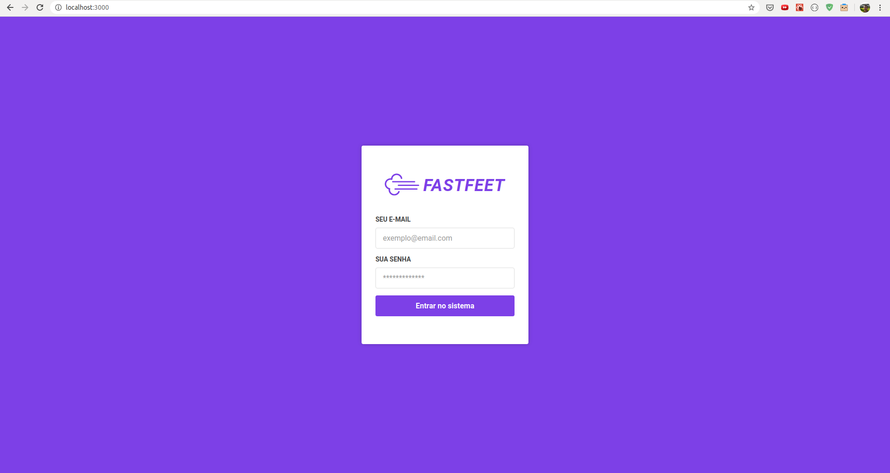 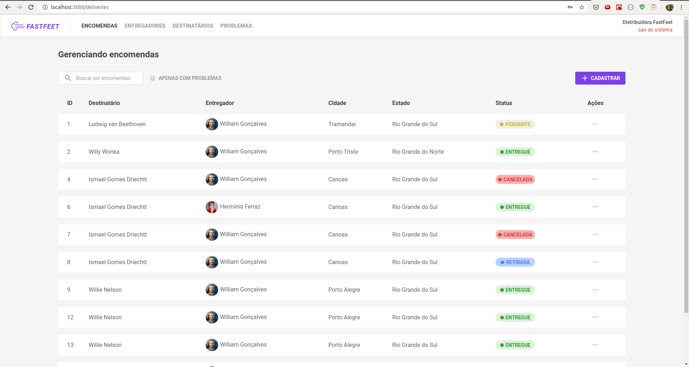 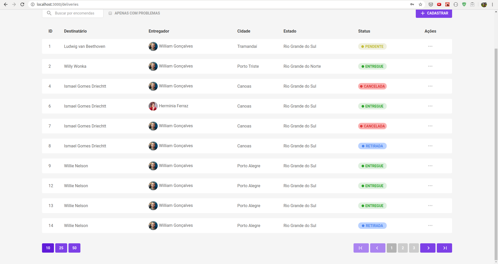   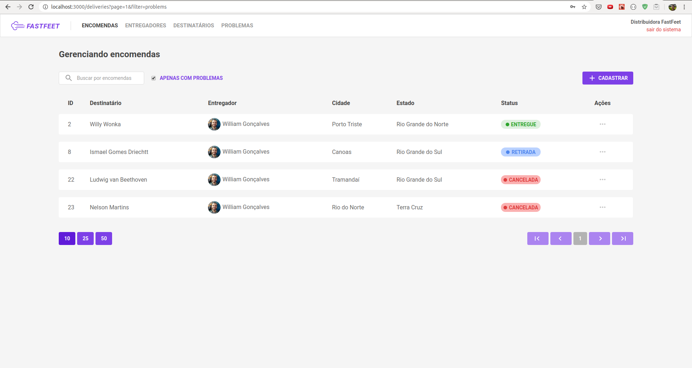 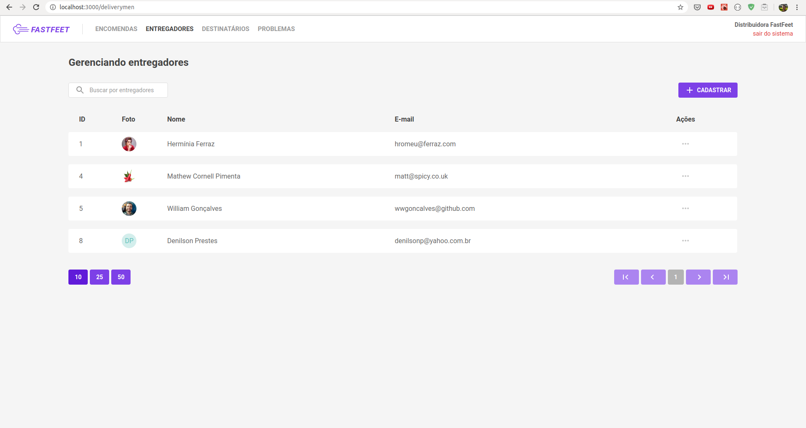 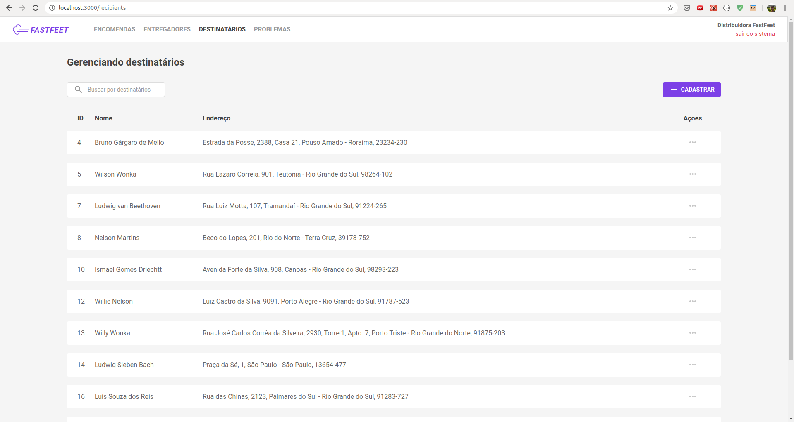   
  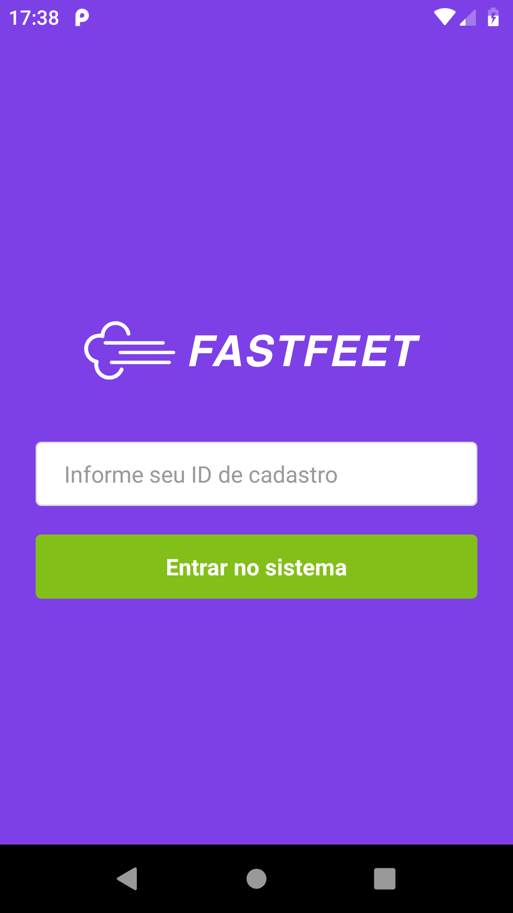 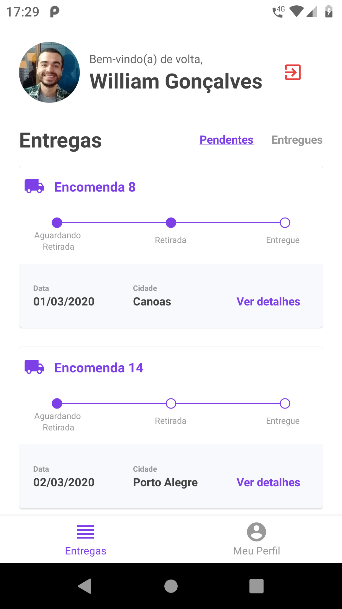 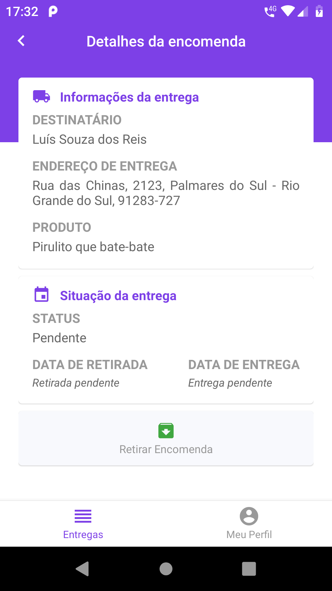 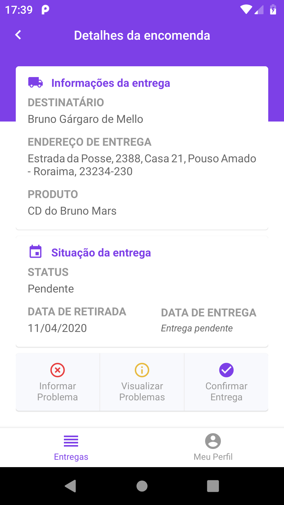 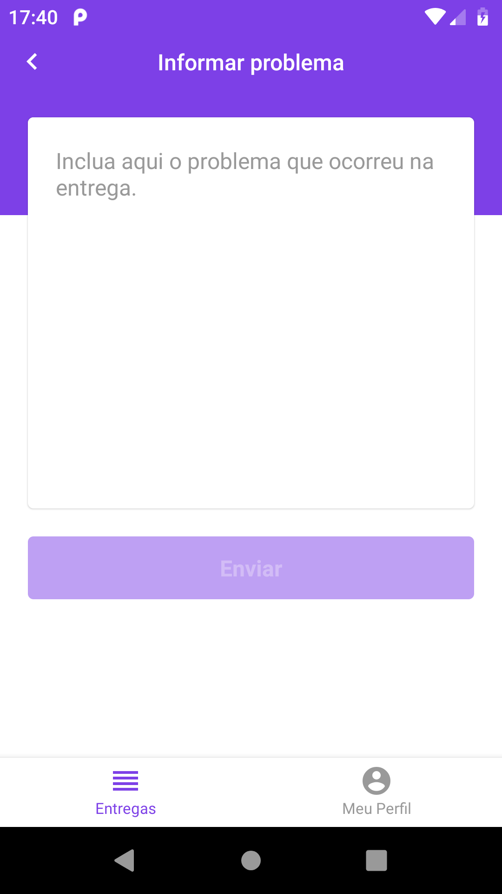   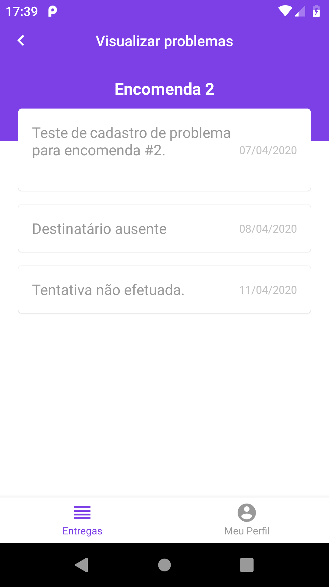 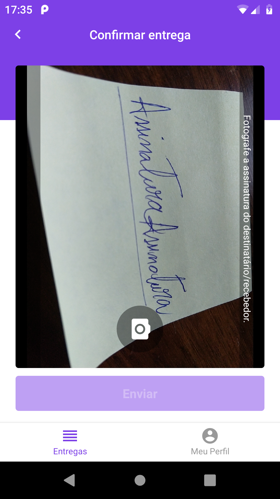 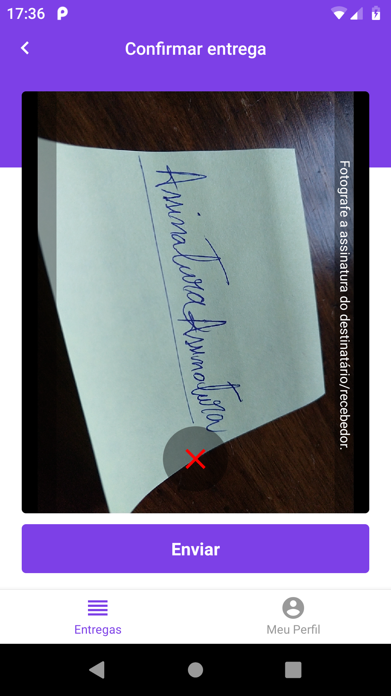 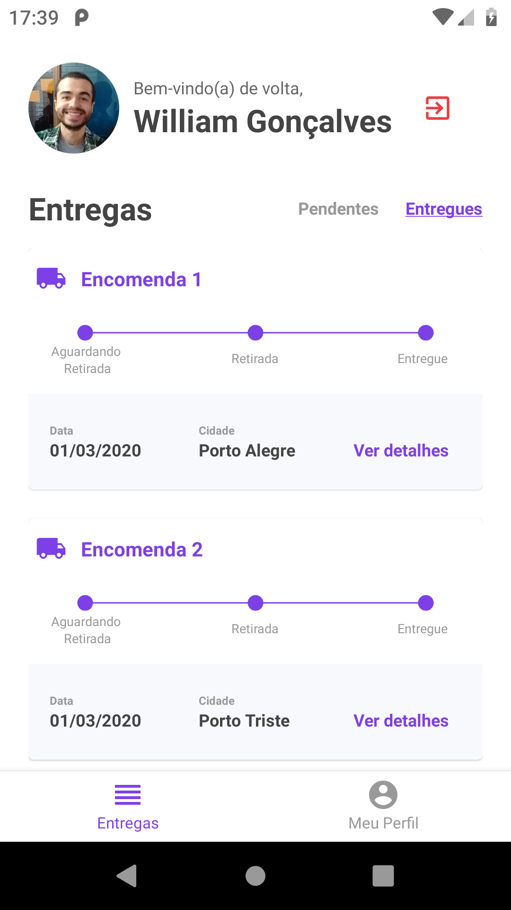 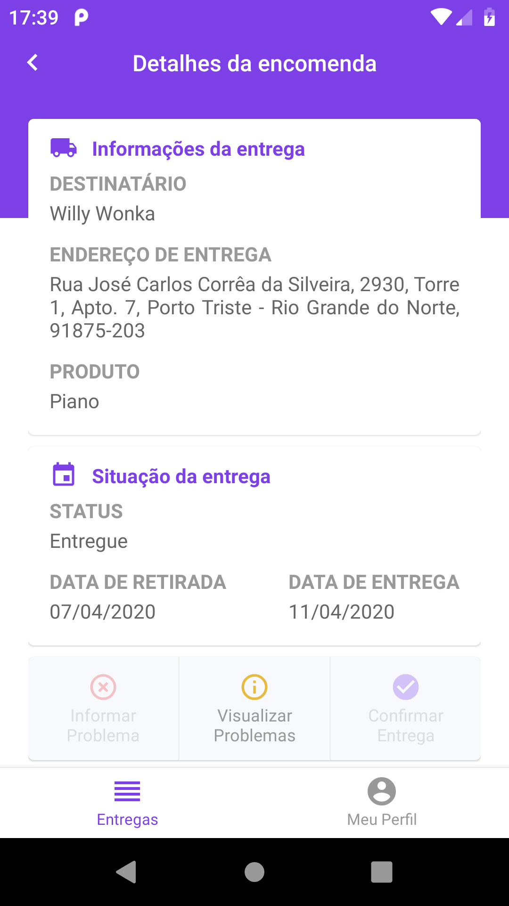
</h2>

---

# Importante

> A aplicação móvel (`mobile`) foi desenvolvida e testada apenas em sistemas **Android** &mdash; via USB em dispositivo físico e em emulador _Genymotion_ da [Genymobile](https://www.genymobile.com/). Nenhum teste foi feito para o iOS, logo, rodar em tal sistema pode demandar alguma adaptação no código.

> Se for do interesse utilizar a solução em ambiente de produção, uma revisão e algumas alterações na segurança do projeto precisarão ser feitas.

# Instalação

Previamente, tenha instalado em seu ambiente o [Node.js](https://nodejs.org/) e o [Yarn](https://yarnpkg.com/). _Durante o desenvolvimento deste projeto, foram utilizadas as versões 10.16.3 do Node.js e 1.21.1 do Yarn._

Para os três ambientes da aplicação, `backend`, `frontend` e `mobile`, a instalação é feita pela execução do comando `yarn` dentro de suas respectivas pastas.

O projeto conta com os SGBDs [PostgreSQL](https://www.postgresql.org/) e [Redis](https://redis.io/) no backend, portanto também precisam ser instalados. _Respectivamente, as versões 11.6 e 5.0.5 foram as utilizadas durante o desenvolvimento, através de imagens oficiais para o [Docker](https://www.docker.com/)._

Mesmo desenvolvida em React Native, outras configurações ainda precisam ser feitas para que uma aplicação Android seja executada através do computador. Um guia completo de configuração e resolução de problemas foi feito pela equipe da Rocketseat e pode ser acessado [aqui](https://react-native.rocketseat.dev/).

# Configurações necessárias

## Backend

Primeiramente, crie um banco de dados no PostgreSQL para a aplicação &mdash; uma aplicação com interface gráfica como o [Postbird](https://github.com/Paxa/postbird) pode ser utilizada. O enconding "UTF8" pode ser o utilizado para o banco de dados.

O backend utiliza a biblioteca [dotenv](https://github.com/motdotla/dotenv) para gerenciar algumas variáveis do ambiente da aplicação. Um arquivo `.env` (exatamente com este nome) deve ser disponibilizado na pasta raiz desta camada, seguindo como exemplo o arquivo `.env.example` disponível na pasta. Todas as variáveis devem ser preenchidas. As variáveis sem valores atribuídos devem ser preenchidas conforme as configurações locais do seu ambiente. _Por exemplo, como valor da variável `DB_NAME`, o nome dado ao banco de dados criado anteriormente deverá ser preenchido._ As variáveis já preenchidas no arquivo de exemplo definem configurações da aplicação, mas também podem ser alteradas.

A aplicação faz o envio de e-mails em algumas ocasiões &mdash; o SGBD Redis é utilizado exclusivamente na gestão das filas de e-mails a enviar. Entre as variávies de ambiente, as iniciadas com `MAIL_` servem para a configuração do servidor SMTP responsável pelo envio. Nelas podem ser configurados serviços de teste de envio de e-mails como o [Mailtrap](https://mailtrap.io/), por exemplo. É comum que o Redis, variáveis `REDIS_`, seja configurado para o host `127.0.0.1` (endereço local) e porta `6379`.

Com todas as variáveis de ambiente configuradas e salvas no arquivo `.env` na pasta `backend/`, na mesma pasta, execute o seguinte:

| Comando                      | Função                                                          |
| ---------------------------- | --------------------------------------------------------------- |
| `yarn sequelize db:migrate`  | Executa as _migrations_ (criações/alterações de tabelas) no BD. |
| `yarn sequelize db:seed:all` | Executa a _seed_ que cria o usuário administrador no BD.        |

## Frontend

A solução dotenv também é utilizada no frontend em ReactJS. No arquivo `.env`, que também precisará ser disponibilizado na pasta raiz desta camada, a variável `REACT_APP_API_URL` precisa estar configurada com o endereço e a porta onde a API da aplicação (camada backend) estará rodando. Já há um arquivo `.env.example` de exemplo disponível.

Se for do interesse, para debugging do Redux, os estados de sua _Store_ e de seus _sagas_ pode ser usada a ferramenta [Reactotron](https://github.com/infinitered/reactotron), já configurada na aplicação.

## Mobile (Android)

Para o aplicativo móvel, o endereço e a porta onde a API estará rodando são configurados diretamente no arquivo que exporta o serviço de chamadas à API (`mobile/src/services/api.js`).

O app móvel também está configurado para que se utilize o Reactotron na inspeção do Redux e, neste ambiente, a ferramenta ainda fará a interceptação das chamadas à API. A porta padrão utilizada pelo Reactotron é a `9090` e provavelmente o redirecionamento dessa porta precisará ser feito com o comando `adb reverse tcp:9090 tcp:9090`. Dependendo de como a aplicação será executada, em dispositivo físico ou emulador, a chamada do método `configure()` no arquivo de configuração do Reactotron (`mobile/src/config/ReactotronConfig.js`) pode precisar ser editada especificando o IP do computador na rede ([um exemplo](https://github.com/infinitered/reactotron/issues/162#issuecomment-514042089)).

# Execução dos ambientes

## Backend

_Os bancos PostgreSQL e Redis devem ser previamente iniciados._

| Comando      | Função                                    |
| ------------ | ----------------------------------------- |
| `yarn dev`   | Inicia o núcleo da API.                   |
| `yarn queue` | Inicia o gerenciador de filas de e-mails. |

## Frontend

| Comando      | Função                                                                   |
| ------------ | ------------------------------------------------------------------------ |
| `yarn start` | Inicia a aplicação web (uma janela do navegador abrirá automaticamente). |

_Na tela de login, acesse o sistema com as credenciais do usuário administrador criado anteriormente: e-mail `admin@fastfeet.com` e senha `123456`._

## Mobile (Android)

| Comando                                | Função                                                                   |
| -------------------------------------- | ------------------------------------------------------------------------ |
| `npx react-native start --reset-cache` | Inicia o gerenciador do pacote da aplicação.                             |
| `npx react-native run-android`         | Monta e instala a aplicação no dispositivo Android conectado ou emulado. |

_Possivelmente um bug, mudar a ordem da execução dos comandos acima resulta numa aplicação "em branco" no dispositivo._

É provável que o redirecionamento de portas, entre o dispositivo Android e o computador rodandos os serviços, precise ser realizado. Particularmente, o seguinte comando é o que tem sido utilizado via terminal e que abrange todas as portas necessárias pelas configurações originais: `adb reverse tcp:3333 tcp:3333 && adb reverse tcp:8081 tcp:8081 && adb reverse tcp:9090 tcp:9090`. _Esse comando será fundamental se, no arquivo `.env` da camada `backend`, as variáveis ambiente `APP_URL` estiver configurada como `localhost` e a `PORT` como `3333`, conforme as configurações originais de exemplo dada àquela camada._

_Para acessar as funções do app, um entregador precisará ser criado pelo usuário administrador no frontend web de gestão. Apenas o número identificador do entregador, gerado automaticamente, é usado no login do app._

# Observações exclusivas aos certificadores

- Também foram desenvolvidos os requisitos opcionais colocados nas etapas do projeto (paginação das listagens, máscara de CEP, filtro na listagem de encomendas e scroll infinito).
- O desenvolvimento das interfaces visuais buscou ser fiel ao resultado esperado dos layouts entregues pela plataforma online da Adobe XD. Apenas assimetrias e dimensões "quebradas" foram sendo ajustadas durante a implementação.
- Uma e outra decisão de design precisou ser tomada para contornar qualquer falta de especificação (p. ex. função de retirada da encomenda pelo app móvel).
- Por algum motivo, talvez limitação na emulação, o comportamento visual do componente de câmera e seu container, na tela de confirmação da entrega, é diferente entre o dispositivo físico e o emulado.

# Considerações finais

- Se interessou na solução e quer usá-la/estendê-la numa ideia similar (um serviço com tele-entregas, por exemplo)? Legal!!! Toca ficha! Use o código como quiser!
- Seguiu o passo-a-passo, está enfrentando problemas e acredita que há algo de errado no README ou no código da aplicação, abra uma issue que lhe ajudarei.
- Gostou da implementação e acredita que posso ajudar em projetos da sua equipe? Que massa!!! Abra uma issue por aqui para trocarmos uma ideia e contatos. :)

---

_A ideia da aplicação, os logotipos usados e os layouts originais das páginas e telas do projeto foram todos concebidos pela equipe da [Rocketseat](https://rocketseat.com.br/) :clap: :clap: :rocket:._

[1]: https://github.com/wwgoncalves/bootcamp-gostack-desafio-02 "Especificações do backend 1/2"
[2]: https://github.com/wwgoncalves/bootcamp-gostack-desafio-03 "Especificações do backend 2/2"
[3]: https://github.com/wwgoncalves/bootcamp-gostack-desafio-09 "Especificações do frontend web"
[4]: https://github.com/wwgoncalves/bootcamp-gostack-desafio-10 "Especificações do app mobile"
