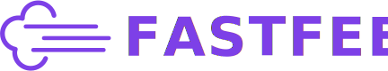

<h1 align="center">
    
  
</h1>

O projeto FastFeet é uma solução ponta-a-ponta para gestão de encomendas.

Abrangendo três camadas -- server API (backend), interface web para gestão (frontend) e app móvel para entregadores (mobile) --, a aplicação é desafio final para avaliação e emissão de certificado do treinamento online <em>GoStack</em> criado e lecionado pela <a href="https://rocketseat.com.br/">Rocketseat</a>.

---

## Observações gerais

- A aplicação móvel (`mobile`) foi desenvolvida e testada apenas em ambientes **Android** -- via USB em dispositivo físico e em emulador _Genymotion_ da [Genymobile](https://www.genymobile.com/).

## Instalação

Para as três camadas desenvolvidas da aplicação, `backend` [[1]] [[2]], `frontend` [[3]] e `mobile` [[4]], a "instalação" é feita com a execução do comando `yarn` dentro de suas respectivas pastas.

_Previamente, tenha instalado em seu ambiente o [Node.js](https://nodejs.org/) e o [Yarn](https://yarnpkg.com/). Durante o desenvolvimento deste projeto, foram utilizadas as versões 10.16.3 do Node.js e 1.21.1 do Yarn._

## Configurações necessárias

### Backend

### Frontend

### Mobile

## Execução

| Backend            | Frontend           | Mobile             |
| ------------------ | ------------------ | ------------------ |
| conteúdo aqui      | conteúdo aqui      | conteúdo aqui      |
| mais conteúdo aqui | mais conteúdo aqui | mais conteúdo aqui |

---

_A ideia da aplicação, os logotipos e os layouts originais das páginas e telas do projeto foram todos concebidos pelo time da [Rocketseat](https://rocketseat.com.br/) :clap: :clap: :rocket:._

[1]: https://github.com/wwgoncalves/bootcamp-gostack-desafio-02 "Especificações do backend 1/2"
[2]: https://github.com/wwgoncalves/bootcamp-gostack-desafio-03 "Especificações do backend 2/2"
[3]: https://github.com/wwgoncalves/bootcamp-gostack-desafio-09 "Especificações do frontend web"
[4]: https://github.com/wwgoncalves/bootcamp-gostack-desafio-10 "Especificações do app mobile"
